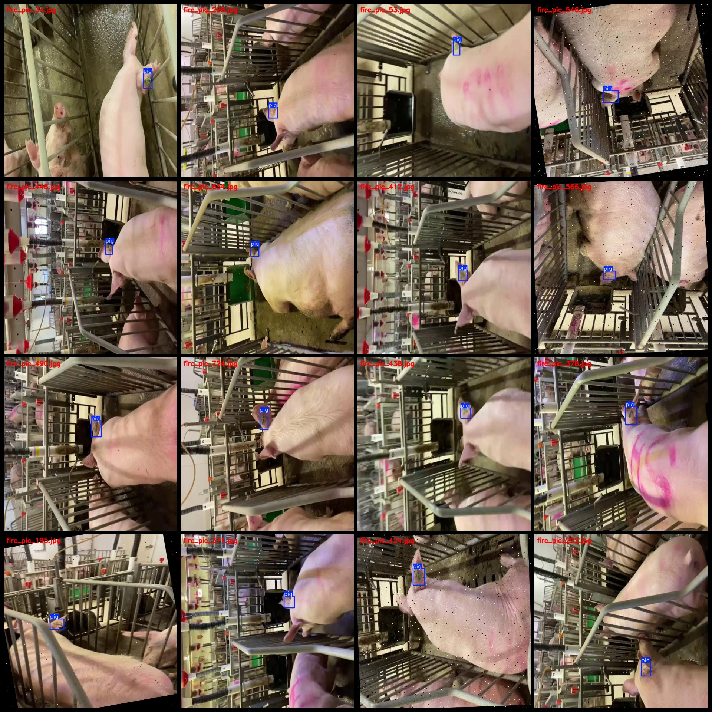
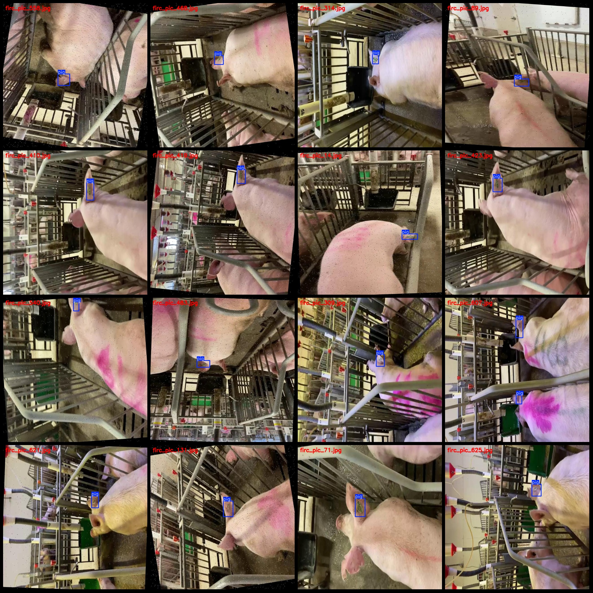

# Pig Welfare Inspection Data Set: Pascal VOC+YOLO Format with Enhanced Images

Please note that more than half of the images in this dataset are enhanced. Please review the image previews.

Dataset format: Pascal VOC format + YOLO format (without split path in the txt file, only containing jpg images along with their corresponding VOC format xml files and YOLO format txt files)

Number of images (jpg file count): 744
Number of annotations (xml file count): 744
Number of annotations (txt file count): 744
Number of annotation categories: 1
Annotation category name: ["pig"]
Number of bounding box per category:
- Pig bounding boxes = 801
Total bounding boxes: 801
Number of images each category occupies:
- Pig images = 744
Image resolution: 640x640
Annotation tool used: labelImg
Annotation rule: Draw a rectangular bounding box for the category
Important notice: The dataset does not have been divided into training, validation, or test sets; you need to do so yourself.
Special statement: This dataset does not guarantee the accuracy of the trained models or weight files.
Image previews:
Annotation example:

## Images

Here is a pay link on Stripe ( https://buy.stripe.com/3cs8yP7sY87d0vu9AB ). Please contact me lonlonago@foxmail.com after funding $89, and I will send you a complete data files , thank you!

